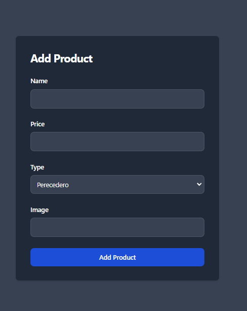

### Tecnologías Utilizadas y Elección

El proyecto ha sido desarrollado utilizando las siguientes tecnologías principales, seleccionadas por las siguientes razones:

- **React**: Se eligió React debido a su eficiencia en la creación de interfaces de usuario dinámicas y su popularidad en el desarrollo de aplicaciones web modernas. React permite la creación de componentes reutilizables que facilitan el mantenimiento y escalabilidad del proyecto.

  

- **Redux**: Redux fue elegido para la gestión del estado global de la aplicación debido a su capacidad para manejar de manera predecible el flujo de datos en aplicaciones complejas. Facilita la centralización del estado, lo que es crucial para mantener la coherencia de datos en toda la aplicación.

  

- **Tailwind CSS**: Tailwind CSS se seleccionó por su enfoque en la construcción de interfaces de usuario mediante clases utilitarias. Esto permite un estilo rápido y coherente sin la necesidad de escribir CSS personalizado extenso, lo que acelera el desarrollo y facilita el mantenimiento del estilo.

  

- **JavaScript**: Como lenguaje base, JavaScript fue elegido por su versatilidad y amplio soporte en el desarrollo web. Proporciona las funcionalidades esenciales para la lógica de la aplicación del lado del cliente y la interacción dinámica con los usuarios.

  

Estas tecnologías fueron seleccionadas por sus capacidades individuales para mejorar la eficiencia del desarrollo, la escalabilidad del proyecto y la capacidad de mantenimiento a largo plazo.


### Implementación de Estilos

**Tecnología de Estilos:**
Utilizamos Tailwind CSS para la implementación de estilos en este proyecto. Elegimos Tailwind CSS por su enfoque en la utilidad y la capacidad de mantener un diseño coherente a lo largo de la aplicación sin la necesidad de escribir CSS personalizado extenso.

**Aplicación de Estilos:**
Hemos aplicado clases de Tailwind CSS directamente en nuestros componentes React para definir la apariencia y el diseño. Esto nos ha permitido crear rápidamente componentes con estilos consistentes y responsivos.

Ejemplo de uso de Tailwind CSS en un componente:

```jsx
import React from 'react';

const ExampleComponent = () => {
  return (
    <div className="bg-gray-800 p-4 rounded-lg shadow-md">
      <h2 className="text-white text-lg font-bold">Ejemplo de Componente</h2>
      <p className="text-gray-300 mt-2">Este es un ejemplo de cómo aplicamos estilos con Tailwind CSS.</p>
    </div>
  );
};

export default ExampleComponent;
```


#### Diseño Coherente y Atractivo

Se ha aplicado un diseño coherente y atractivo en toda la aplicación utilizando las clases de Tailwind CSS. A continuación, se muestran ejemplos de cómo se han aplicado los estilos en algunos componentes clave:

- **Navbar**: Utiliza clases como `bg-gray-800`, `text-white`, y `flex items-center` para un diseño claro y funcional.
  
- **Listado de Productos**: Cada producto está contenido en un componente con clases como `bg-white`, `shadow-md`, y `rounded-xl` para un aspecto limpio y moderno.

- **Formularios**: Los formularios hacen uso de clases como `px-4 py-2`, `border`, y `rounded-lg` para asegurar una presentación uniforme y accesible.

Estos ejemplos muestran cómo Tailwind CSS facilita la creación de interfaces coherentes y estéticamente agradables en toda la aplicación.
### Configuración y Ejecución del Proyecto

**Instalación de Dependencias:**
1. Clona este repositorio: `git clone https://github.com/daelflodo/client-store.git`
2. Instala las dependencias: `npm install`

**Configuración del Backend:**
Para conectar con el backend, puedes ir al repositorio del proyecto: `https://github.com/daelflodo/server-store`

Para configurar la conexión con el backend, asegúrate de ajustar la configuración en el archivo `services/api.js`. Dependiendo de tu entorno, configura la baseURL adecuadamente:

```javascript
const api = axios.create({
  // baseURL: 'http://localhost:8080/', // URL de tu backend en Localhost
  baseURL: 'https://server-store-sob3.onrender.com/', // URL de tu backend desplegado
  headers: {
    'Content-Type': 'application/json',
  },
});
```
Asegúrate de comentar/descomentar la línea baseURL según estés trabajando en local o conectándote a tu backend desplegado. Esta configuración permite que tu frontend se comunique correctamente con el backend correspondiente.

### Estructura del Proyecto

El proyecto está organizado de la siguiente manera:

- **`common/`**: Contiene archivos compartidos como constantes y validaciones para los formularios.

- **`components/`**: Aquí se encuentran todos los componentes de React organizados por funcionalidad (por ejemplo, `ProductList`, `ProductDetail`, `StoreList`, etc.).

- **`redux/`**: Contiene la configuración de Redux, incluyendo acciones (`actions/`) y el reducer (`reducer/`). El archivo `store.js` configura el store Redux centralizado para la aplicación.

- **`services/`**: Contiene el archivo `api.js` que configura la conexión con el backend a través de Axios, como se mencionó anteriormente.

Esta estructura organizada facilita el mantenimiento y la expansión del proyecto al separar claramente las responsabilidades y funcionalidades de cada parte del sistema.


**Ejecución del Proyecto:**
Una vez configurado, puedes ejecutar el proyecto con el siguiente comando: ``npm start``


Esto iniciará la aplicación en modo de desarrollo. Abre [http://localhost:3000](http://localhost:3000) para verla en el navegador.

### Capturas de Pantalla

Aquí se muestran capturas de pantalla de la aplicación en funcionamiento:

1. **Página de Listado de Productos:**
  

2. **Detalle de Producto:**
   

3. **Formulario de Producto:**
   

4. **Página de Listado de Tiendas:**
   

5. **Detalle de Tienda:**
   
